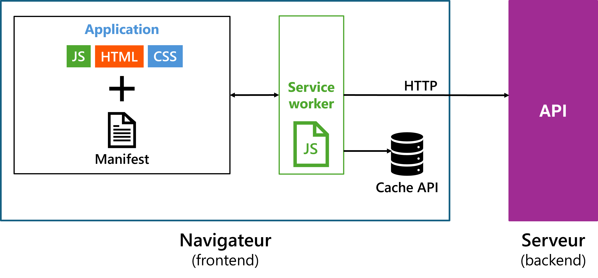

## Qu'est-ce qu'une PWA ?

Une **Progressive Web App** (PWA) est une application web conçue pour offrir une expérience proche des applications natives tout en conservant les avantages du web : pas d'installation obligatoire via un magasin d'applications, mise à jour instantanée, URL partageable.

Concrètement, une PWA c'est :

- Un site web normal (HTML / CSS / JS),
- **Plus** un fichier de métadonnées (le **manifeste**) qui le rend installable,
- **Plus** un script exécuté en arrière-plan (le **Service Worker**) qui le rend utilisable hors-ligne.

Le qualificatif « progressive » signifie que l'application fonctionne pour tout le monde mais offre des capacités supplémentaires (installation, notifications, hors-ligne) aux utilisateurs dont le navigateur les supporte.

## Les critères d'une PWA

Pour qu'une application soit considérée comme une PWA, elle doit remplir **quatre critères fondamentaux** :

1. **Installable** — L'utilisateur peut l'ajouter à son écran d'accueil (mobile) ou son bureau (desktop). Cela requiert un manifeste valide.
2. **Fonctionne hors-ligne** — L'application démarre et affiche du contenu même sans connexion. Cela requiert un Service Worker.
3. **Servie en HTTPS** — Obligation absolue : les Service Workers ne s'enregistrent que sur un site HTTPS (ou `localhost` en développement).
4. **Responsive et performante** — L'interface s'adapte aux écrans et charge rapidement.

Ces quatre critères sont **exactement ceux audités par Lighthouse** (onglet « PWA » dans Chrome DevTools), que vous utiliserez au projet 2.

## Architecture d'une PWA



- **L'application** : le site React que vous avez construit.
- **Le manifeste** : un fichier JSON qui décrit le nom, les icônes et le mode d'affichage.
- **Le Service Worker** (couvert en détail la [semaine 6](/notes/week6)) : un script qui intercepte les requêtes réseau et gère le cache.
- **Le Cache API** : stockage des ressources pour un accès hors-ligne.

## Le manifeste

Le manifeste est un fichier JSON servi avec l'extension `.webmanifest` (type MIME `application/manifest+json`). Il donne au navigateur les informations nécessaires pour installer l'application.

### Exemple complet

```json title="public/manifest.webmanifest"
{
  "name": "Avis et alertes Montréal",
  "short_name": "Avis MTL",
  "description": "Consultez les avis et alertes de la Ville de Montréal",
  "start_url": "/",
  "scope": "/",
  "display": "standalone",
  "orientation": "portrait",
  "background_color": "#ffffff",
  "theme_color": "#bb2649",
  "lang": "fr-CA",
  "icons": [
    {
      "src": "/icons/icon-192.png",
      "sizes": "192x192",
      "type": "image/png",
      "purpose": "any"
    },
    {
      "src": "/icons/icon-512.png",
      "sizes": "512x512",
      "type": "image/png",
      "purpose": "any"
    },
    {
      "src": "/icons/icon-maskable-512.png",
      "sizes": "512x512",
      "type": "image/png",
      "purpose": "maskable"
    }
  ]
}
```

### Les champs à connaître

| Champ | Rôle |
|---|---|
| `name` | Nom complet affiché lors de l'installation |
| `short_name` | Nom court affiché sous l'icône (≤ 12 caractères) |
| `start_url` | URL chargée au lancement (typiquement `/`) |
| `scope` | Portée de l'application (URLs que le SW contrôle) |
| `display` | `standalone`, `fullscreen`, `minimal-ui` ou `browser` |
| `background_color` | Couleur affichée pendant le chargement initial |
| `theme_color` | Couleur de la barre de statut / onglet |
| `icons` | Tableau d'icônes (au moins 192 et 512 px) |

### Icônes : le détail qui compte

Trois types d'icônes sont requis pour une PWA vraiment installable :

1. **Icône standard (`purpose: "any"`)** — 192×192 et 512×512 PNG.
2. **Icône adaptative (`purpose: "maskable"`)** — 512×512 avec une zone de sécurité (le contenu principal doit tenir dans un cercle au centre). Android découpe cette icône pour l'adapter à la forme du thème (ronde, carrée, goutte…). Sans elle, votre icône peut apparaître avec des bordures blanches disgracieuses.
3. **Icône Apple Touch** — 180×180 PNG, référencée depuis le HTML (voir ci-dessous).

Outil pratique pour générer tout ça : [PWA Builder](https://www.pwabuilder.com/imageGenerator).

## Lier le manifeste au HTML

Un manifeste n'est jamais chargé automatiquement : il faut le déclarer dans le `<head>` de votre `index.html`, avec les métadonnées iOS en complément (Safari ne lit pas tout le manifeste) :

```html title="index.html"
<head>
  <meta charset="UTF-8" />
  <meta name="viewport" content="width=device-width, initial-scale=1.0" />

  <!-- Lien vers le manifeste -->
  <link rel="manifest" href="/manifest.webmanifest" />

  <!-- Couleur du thème (barre d'adresse, barre de statut) -->
  <meta name="theme-color" content="#bb2649" />

  <!-- iOS : Safari ne lit pas complètement le manifeste -->
  <link rel="apple-touch-icon" href="/icons/apple-touch-icon-180.png" />
  <meta name="apple-mobile-web-app-capable" content="yes" />
  <meta name="apple-mobile-web-app-status-bar-style" content="default" />
  <meta name="apple-mobile-web-app-title" content="Avis MTL" />

  <title>Avis et alertes Montréal</title>
</head>
```

:::caution[Sans ces balises, iOS ignore votre PWA]
Safari iOS ne consulte pas (ou très partiellement) le manifeste. Les balises `apple-*` et `apple-touch-icon` sont **indispensables** pour qu'un utilisateur iOS puisse ajouter l'application à son écran d'accueil avec la bonne icône et le bon nom.
:::

## L'invitation à l'installation

Sur Chrome Android et Edge desktop, si votre PWA remplit les critères, le navigateur propose automatiquement une invitation « Ajouter à l'écran d'accueil » via l'événement `beforeinstallprompt`. Vous pouvez capter cet événement pour l'intercepter et afficher votre propre bouton d'installation.

Sur **iOS**, il n'y a pas d'invitation automatique : l'utilisateur doit manuellement appuyer sur **Partager → Sur l'écran d'accueil**. Prévoyez une instruction visible pour guider vos utilisateurs iOS.

## Outils recommandés

### `vite-plugin-pwa`

Étant donné qu'on utilise Vite, l'outil standard pour automatiser la génération du manifeste et du Service Worker est [`vite-plugin-pwa`](https://vite-pwa-org.netlify.app/).

```sh
npm install -D vite-plugin-pwa
```

```js title="vite.config.js"
import { defineConfig } from 'vite';
import react from '@vitejs/plugin-react';
import { VitePWA } from 'vite-plugin-pwa';

export default defineConfig({
  plugins: [
    react(),
    VitePWA({
      registerType: 'autoUpdate',
      manifest: {
        name: 'Avis et alertes Montréal',
        short_name: 'Avis MTL',
        theme_color: '#bb2649',
        icons: [
          { src: '/icons/icon-192.png', sizes: '192x192', type: 'image/png' },
          { src: '/icons/icon-512.png', sizes: '512x512', type: 'image/png' },
          { src: '/icons/icon-maskable-512.png', sizes: '512x512', type: 'image/png', purpose: 'maskable' },
        ],
      },
    }),
  ],
});
```

Le plugin génère automatiquement le manifeste, enregistre un Service Worker basé sur Workbox, et gère la mise à jour.

### Lighthouse


Lighthouse (onglet de Chrome DevTools) est l'**outil officiel** d'audit PWA. Il valide :

- Le manifeste (champs, icônes, scope).
- L'enregistrement du Service Worker.
- La configuration HTTPS.
- La performance globale.

**Lancez-le en mode production** (`npm run build` puis `npm run preview`). En mode développement, les scores sont pénalisés par des optimisations désactivées.

## Erreurs communes à éviter

| Erreur | Symptôme | Correction |
|---|---|---|
| Pas de `<link rel="manifest">` dans l'HTML | Manifeste ignoré | Ajouter la balise dans `<head>` |
| Icône sans variante `maskable` | Icône avec bordure blanche sur Android | Ajouter une icône 512×512 `purpose: "maskable"` |
| Oubli des balises `apple-*` | iOS affiche une icône générique | Ajouter `apple-touch-icon` et `apple-mobile-web-app-*` |
| `start_url` non accessible hors-ligne | L'app ne démarre pas en avion | Précacher `start_url` dans le Service Worker |
| Tester Lighthouse en mode dev | Scores artificiellement bas | Toujours auditer le build de production |
| Oubli du HTTPS | Le SW ne s'enregistre pas | Utiliser `localhost` en dev, HTTPS en prod |

## Récapitulatif

1. Une **PWA** est un site web rendu installable et hors-ligne par un **manifeste** et un **Service Worker**.
2. **Quatre critères** : installable, hors-ligne, HTTPS, responsive/performante.
3. Le **manifeste** (`manifest.webmanifest`) décrit le nom, les icônes et le mode d'affichage. Il doit être lié au HTML.
4. Les **icônes** viennent en trois saveurs : standard, maskable (Android), et Apple Touch (iOS).
5. **iOS nécessite des métadonnées HTML supplémentaires** (`apple-*`) car Safari ne lit pas tout le manifeste.
6. **`vite-plugin-pwa`** automatise la génération du manifeste et du Service Worker pour les projets Vite.
7. **Lighthouse** est l'outil de validation — à lancer en mode production.

## Exercices

1. **Manifeste minimal.** Créez un `manifest.webmanifest` pour votre projet 1, puis liez-le depuis `index.html`. Vérifiez dans Chrome DevTools (onglet Application → Manifest) que les champs sont bien détectés.
2. **Icônes.** Générez un jeu complet d'icônes avec RealFaviconGenerator ou maskable.app. Ajoutez-les à votre manifeste et vérifiez le rendu dans la prévisualisation d'installation.
3. **iOS.** Ajoutez les balises `apple-touch-icon` et `apple-mobile-web-app-*` à votre HTML. Testez l'ajout à l'écran d'accueil depuis un iPhone ou un simulateur.
4. **Audit Lighthouse.** Lancez un audit Lighthouse (catégorie PWA) sur le build de production de votre projet. Identifiez les points qui bloquent et planifiez les corrections pour la semaine 6.
5. **`vite-plugin-pwa`.** Installez le plugin, migrez votre manifeste dans `vite.config.js`, et vérifiez que le build génère automatiquement un Service Worker.

## Ressources

- [web.dev — Qu'est-ce qu'une PWA ?](https://web.dev/explore/progressive-web-apps?hl=fr)
- [MDN — Le manifeste d'application web](https://developer.mozilla.org/fr/docs/Web/Progressive_web_apps/Manifest)
- [`vite-plugin-pwa` — Documentation](https://vite-pwa-org.netlify.app/)
- [Apple — Configuring Web Applications for iOS](https://developer.apple.com/library/archive/documentation/AppleApplications/Reference/SafariWebContent/ConfiguringWebApplications/ConfiguringWebApplications.html)